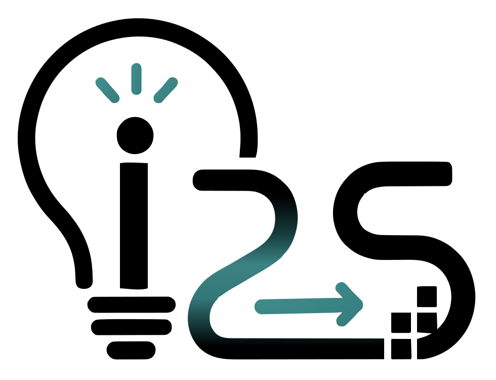
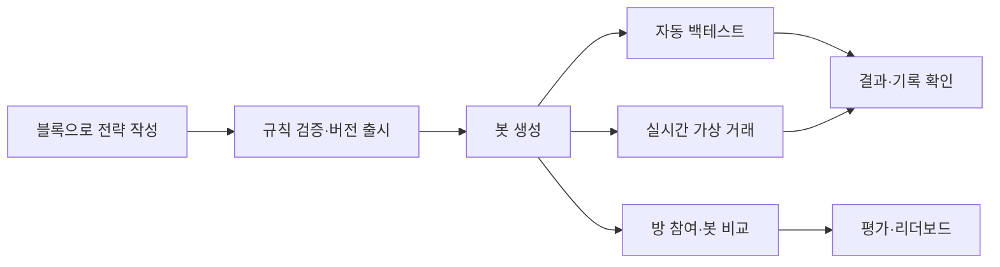
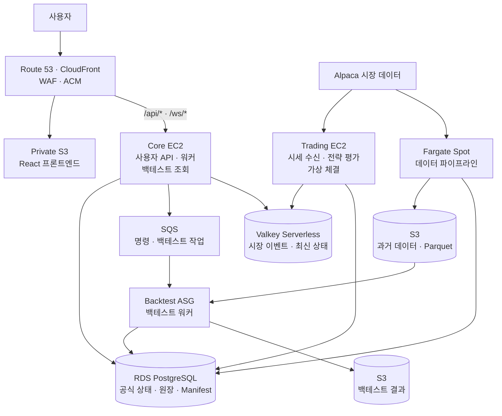

<p align="center">
  
</p>
<!-- Logo source: Idea2Strategy-ui@47a3334aaf7d8560296b75713d213c14fdd24d9c, src/assets/i2s-logo.svg -->

<h1 align="center">Idea2Strategy</h1>

<p align="center">
  <strong>투자 아이디어를 전략으로, 전략을 데이터로!</strong><br />
  블록으로 전략을 만들고, 백테스트와 실시간 가상 거래로 검증하는 투자 전략 실험 플랫폼입니다.
</p>

## 프로젝트 소개 📝

**Idea2Strategy**는 나만의 투자 아이디어를 직접 만들고 검증할 수 있도록 개발 중인 가상 트레이딩 봇 서비스입니다.

매수·매도 조건을 블록으로 연결해 전략을 작성하고, 검증한 전략을 하나의 버전으로 출시합니다. 출시한 전략으로 봇을 생성하면 자동 백테스트를 통해 과거 데이터에서의 결과를 살펴볼 수 있습니다.

봇은 서버에서 실시간 시장 데이터를 받아 가상 거래를 수행합니다. 사용자는 전략의 판단 기록과 거래 결과를 확인하고, 방에서 다른 봇과 성과를 비교하며 아이디어를 발전시킬 수 있습니다.

### 주요 기능

| 기능 | 설명 |
| :--- | :--- |
| 🧩 **블록 기반 전략 편집기** | Basic 편집기에서 매수·매도 조건을 조합하고, 규칙을 검증해 전략을 작성합니다. |
| 🔒 **전략 버전 관리** | 출시한 전략을 변경할 수 없는 버전으로 보관해 실행에 사용한 규칙을 추적합니다. |
| 📊 **자동·기간 지정 백테스트** | 봇 생성 시 자동 백테스트를 수행하고, 원하는 기간의 과거 데이터로 전략을 검증합니다. |
| 🤖 **실시간 가상 거래** | 서버에서 봇을 실행·중지하고, 시장 데이터에 따른 전략 평가와 가상 체결을 확인합니다. |
| 🏆 **방과 성과 비교** | 공통 규칙을 적용하는 방에서 봇을 비교하고, 평가 결과와 리더보드를 확인합니다. |
| 🔍 **판단·거래 기록 조회** | 전략의 판단 과정, 주문·체결, 포지션과 원장 기록을 연결해 결과를 살펴봅니다. |

## 팀원 👨‍💻👩‍💻

프로젝트에 참여한 팀원과 담당 역할입니다.

| Project Manager | Frontend | Backend | Backend | Infrastructure | DB / Data |
| :---: | :---: | :---: | :---: | :---: | :---: |
| <a href="https://github.com/kcrmin"></a> | <a href="https://github.com/SeoDongWi"></a> | <a href="https://github.com/hjcud"></a> | <a href="https://github.com/pjy008008"></a> | <a href="https://github.com/Juwon-Na"></a> | <a href="https://github.com/dertz569"></a> |
| [민경철](https://github.com/kcrmin) | [서동위](https://github.com/SeoDongWi) | [손현준](https://github.com/hjcud) | [박준유](https://github.com/pjy008008) | [나주원](https://github.com/Juwon-Na) | [황영우](https://github.com/dertz569) |
| 제품 방향 수립<br />일정·의사결정<br />팀 협업 조율 | 블록형 편집기<br />화면·UX 설계<br />서비스 UI 구현 | 전략·봇·주문<br />체결·성과 기능<br />서버 설계·구현 | 전략·봇·주문<br />체결·성과 기능<br />서버 설계·구현 | 서버·컨테이너<br />배포 환경 구축<br />운영 구조 설계 | 시장 데이터 수집<br />저장·모델 설계<br />실시간 구조 설계 |

## 프로젝트 기술 스택 💡

### 프론트엔드


- **React · TypeScript · Vite**로 화면을 구성하고, **Lightweight Charts · Three.js**로 차트와 시각화를 구현합니다.
- **Node.js 24 · pnpm 11**, **Vitest · Testing Library · Playwright · MSW**를 사용합니다.

### 백엔드


- **Java 21 · Spring Boot 4.1** 기반으로 사용자 API, 전략·봇 제어, 실시간 전략 평가와 가상 체결을 처리합니다.
- **JPA · jOOQ · Flyway**로 데이터 접근과 마이그레이션을 관리하고, **JUnit · Testcontainers**로 검증합니다.

### 데이터 파이프라인·백테스트


- **Python · FastAPI** 기반 API와 워커가 백테스트를 실행하고 결과를 제공합니다.
- **Alpaca SDK · pandas · NumPy · PyArrow**로 시장 데이터를 수집·가공하고, **Parquet**와 데이터셋 Manifest로 보관합니다.
- **pytest · Ruff · mypy**로 테스트, 코드 검사와 타입 검사를 수행합니다.

### 데이터베이스·스토리지


- **PostgreSQL 16 · Amazon RDS**: 계정, 전략, 봇, 거래 원장과 실행 상태를 저장합니다.
- **Redis 7.4 · Valkey Serverless**: 시장 이벤트와 최신 상태를 관리합니다. 로컬에서는 Redis, AWS 환경에서는 Valkey를 사용합니다.
- **Amazon S3**: 시장 데이터·Parquet, 백테스트 결과와 프론트엔드 정적 파일을 보관합니다.
- **MinIO**: 로컬 개발에서 시장 데이터와 백테스트 결과를 저장하는 S3 호환 객체 저장소입니다.

### 인프라·협업


버전은 저장소의 빌드·의존성 설정을 기준으로 정리했습니다. 서비스별 실행 방법은 각 저장소의 README와 [개발 시작 가이드](docs/development-start-guide.md)를 참고해 주세요.

## 프로젝트 아키텍처 🏛

### 사용자 이용 흐름



### 서비스 구성

| 저장소 | 주요 역할 |
| :--- | :--- |
| [ui](https://github.com/Idea2Strategy/Idea2Strategy-ui) | 전략 편집기, 봇 대시보드, 백테스트, 방·성과, 계정·운영 화면 |
| [backend](https://github.com/Idea2Strategy/Idea2Strategy-backend) | 사용자 API, 계정·권한, 전략·봇 제어, 방·성과, 운영 배치와 Admin MCP |
| [trading-engine](https://github.com/Idea2Strategy/Idea2Strategy-trading-engine) | 실시간 시세 수신, 지표·전략 평가, 가상 주문·체결, 포지션·원장 |
| [backtest-engine](https://github.com/Idea2Strategy/Idea2Strategy-backtest-engine) | 백테스트 API·워커, 과거 데이터 기반 전략 실행과 결과 생성 |
| [data-pipeline](https://github.com/Idea2Strategy/Idea2Strategy-data-pipeline) | 시장 데이터 수집·검증, 기업행사 처리, Parquet·Manifest 발행 |
| **root** | 제품 정의·계약, DBML, 인프라, Docker 실행 구성, 서브모듈 통합 |

### Development 인프라

[현재 Development 설계](docs/infrastructure/architecture.md)를 요약한 구성도입니다.



Core는 상시 실행하고, Trading은 시장 시간에 맞춰 실행합니다. 백테스트 워커는 ASG로 분리하며, 데이터 파이프라인은 작업이 있을 때 실행합니다. 공식 상태는 PostgreSQL에, 대용량 시장 데이터와 결과는 S3에 저장합니다.

### CI/CD

```mermaid
flowchart LR
    PR["Pull Request"] --> CI["GitHub Actions<br/>테스트 · 스키마 · 인프라 검증"]
    CI --> REVIEW["리뷰 후 develop 통합"]
    REVIEW --> RELEASE["Development 릴리스<br/>수동 실행"]
    RELEASE --> BUILD["서비스 이미지 · 프론트엔드 빌드"]
    BUILD --> ARTIFACT["ECR 이미지 digest<br/>S3 릴리스 경로 고정"]
    ARTIFACT --> PLAN["Terraform plan 생성·검토"]
    PLAN --> APPLY["승인한 plan 적용"]
    APPLY --> DEPLOY["서비스 배포 · 상태 검증"]
```



PR 검증은 [CI 워크플로](.github/workflows/ci.yml), 배포 절차는 [Development 릴리스](.github/workflows/development-release.yml)와 [프론트엔드 릴리스](.github/workflows/development-frontend-release.yml)에 정의되어 있습니다.

## 팀 문화 🏠

개발 과정에서 함께 지향하는 협업 원칙입니다. 실행 방법과 변경 기준은 [개발 시작 가이드](docs/development-start-guide.md)를 참고해 주세요.

### 1. 기억보다 기록을

결정의 이유와 영향을 문서에 남기고, 작업 내용과 검증 결과를 Issue·PR에 기록합니다.

### 2. 함께 만드는 기능, 분명한 담당 범위

작업마다 수정 범위를 명확히 합니다. 동시에 작업할 때는 별도 브랜치와 작업 공간을 사용해 서로의 변경을 보호합니다.

### 3. 작은 PR로 자주 확인하기

하나의 작업을 검토 가능한 크기로 나눕니다. 협업이 필요한 변경은 PR로 공유하고, 변경 이유와 검증 결과를 함께 확인합니다.

### 4. 연결은 약속부터

서비스 사이의 API·이벤트·데이터 형식을 먼저 맞춥니다. 상대 기능이 준비되는 동안에는 합의한 계약과 예제 데이터로 개발하고, 연결한 뒤 함께 검증합니다.

### 5. 동작 확인까지가 개발

코드 작성에 이어 테스트와 실행 결과를 확인합니다. 여러 서비스가 연결되는 기능은 사용자의 전체 흐름까지 검증합니다.

### 6. 다음 사람이 이어갈 수 있게

실행 방법, 작업의 선행 조건과 남은 문제를 공유합니다. 새로 합류한 팀원도 같은 문서와 같은 저장소 기준으로 작업을 이어갈 수 있게 합니다.

## 시작하기 🚀

Git, Docker Desktop, PowerShell 5.1 이상을 준비해 주세요. 서비스별로 직접 실행할 경우에는 위 기술 스택에 맞는 런타임도 필요합니다.

### 1. 저장소 받기

GitHub 루트 저장소는 다섯 서비스 저장소를 **Git submodule**로 관리합니다.

```bash
git clone --recurse-submodules --branch develop https://github.com/Idea2Strategy/Idea2Strategy.git
cd Idea2Strategy
```

이미 받은 저장소에서 서브모듈을 초기화하려면 다음을 실행합니다.

```bash
git submodule update --init --recursive
```

### 2. 개발 환경 실행

Docker Desktop을 실행한 뒤 다음 명령으로 로컬 환경을 시작합니다.

```powershell
.\scripts\dev.ps1 up -Scope all -WithBackend -NoBrowser
```

기본 프론트엔드 주소는 [localhost:15173](http://localhost:15173)입니다. 환경 설정, 테스트, 중지 방법은 [개발 시작 가이드](docs/development-start-guide.md)를 참고해 주세요.

### 3. 실행 상태 확인·종료

```powershell
.\scripts\dev.ps1 status
.\scripts\dev.ps1 down
```

## 프로젝트 문서 📚

- [개발 시작 가이드](docs/development-start-guide.md)
- [제품 정의](specs/product/summary.md) · [서비스 계약](contracts/)
- [프로젝트 결정 사항](docs/project-decisions.md)
- [백테스트 의미 일관성 검토](docs/backtest-semantic-integrity-audit.md)
- [Development 인프라 설계](docs/infrastructure/architecture.md) · [배포 준비 가이드](docs/infrastructure/deploy-readiness-runbook.md)
- [데이터 모델 DBML](db/schema.dbml)
