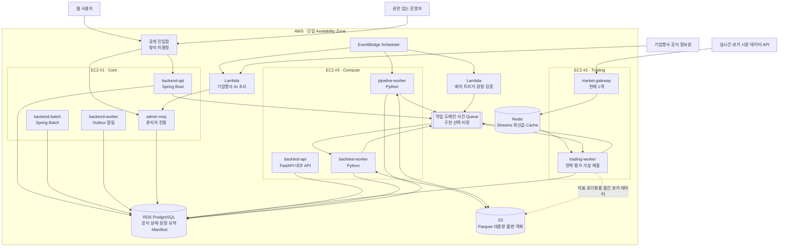
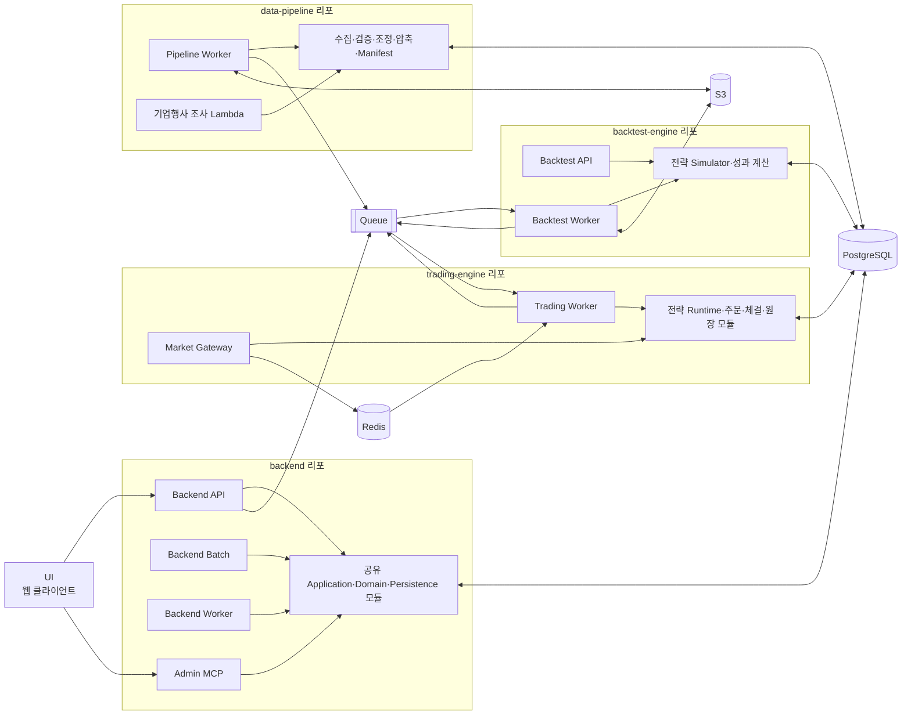
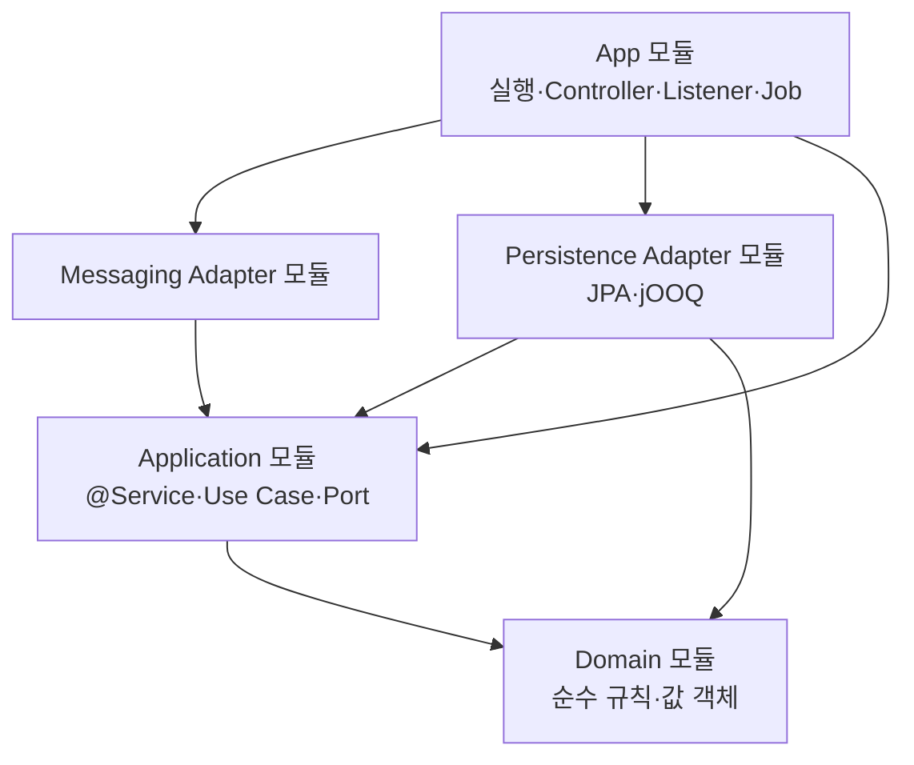
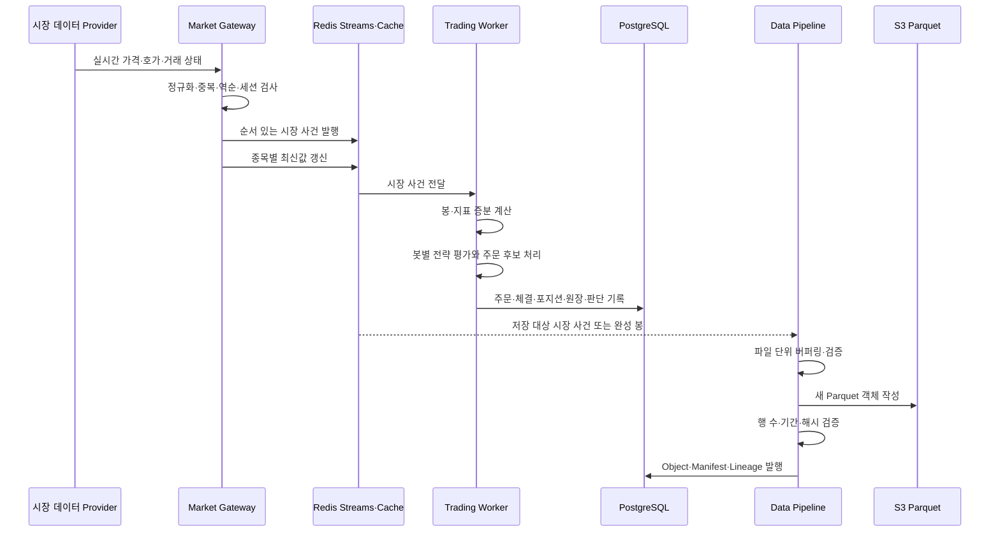
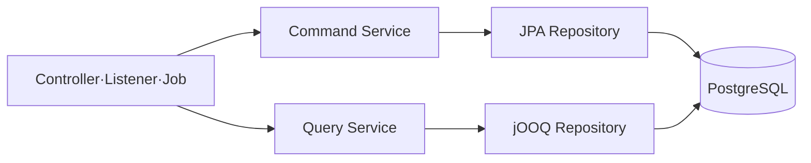

# Idea2Strategy 백엔드·AWS 아키텍처 기준

## 1. 문서 목적과 상태

이 문서는 Idea2Strategy의 AWS 배치도와 서비스 아키텍처 그림을 작성하기 위한 현재 기준이다.

- 제품·데이터 의미의 정본은 `specs/`, `docs/product-discovery.md`, `db/schema.dbml`이다.
- 이 문서는 구현 전 배치와 책임을 정리한 아키텍처 기준이며 상세 인프라 명세나 배포 완료 상태를 뜻하지 않는다.
- 기존 UI는 서버 실행 책임을 갖지 않는 웹 클라이언트다.
- 사용자의 브라우저 상태와 관계없이 전략 평가, 주문, 가상 체결, 백테스트와 배치는 서버에서 수행한다.
- 현재 운영 배치는 단일 Availability Zone을 전제로 한다.
- 현재 Market Gateway는 1개로 시작하고 추후 2개 운영을 검토한다.

### 현재 확정 또는 채택한 방향

- 최상위 조정 리포 아래에 백엔드 관련 Git 서브모듈 4개를 둔다.
- 범용 백엔드와 실시간 트레이딩 엔진은 Java·Spring Boot를 사용한다.
- 두 Spring 리포는 Gradle 멀티프로젝트 구조를 사용한다.
- 백테스트 엔진과 시장 데이터 파이프라인은 Python을 사용한다.
- 백테스트 서비스는 FastAPI 기반 내부 API와 별도 Worker로 구성한다.
- 대용량 시장 데이터와 백테스트 상세 데이터는 S3의 Parquet 객체로 저장한다.
- PostgreSQL에는 공식 운영 데이터, 실행 상태, 요약과 객체 Manifest를 저장한다.
- CQRS-lite로 Spring Command는 주로 JPA, Query는 jOOQ를 사용한다.
- Python은 필요한 일부 테이블에 SQLAlchemy Core를 사용한다.
- DB Migration 도구는 Flyway 하나로 통일하고 Alembic은 사용하지 않는다.
- Redis는 실시간 시장 사건 전달과 최신값 캐시에 사용하되 공식 장기 정본으로 사용하지 않는다.

### 아직 확정하지 않은 인프라 세부사항

- EC2 인스턴스 타입과 정확한 CPU·메모리
- 공개 진입점으로 ALB, API Gateway 또는 다른 Reverse Proxy 중 무엇을 사용할지
- 서비스 제어 명령과 일반 도메인 사건에 SQS, Redis Streams 또는 다른 Broker 중 무엇을 사용할지
- Redis를 ElastiCache로 운영할지 다른 Redis 호환 서비스로 운영할지
- Trading EC2의 정확한 시작·종료 여유 시간
- 백테스트와 Pipeline 작업의 동시 실행 수와 자원 할당량
- 어떤 Pipeline 파티션까지 Lambda에서 처리할지에 대한 크기·시간 기준
- S3 Parquet의 최종 압축 Codec과 물리 파티션 크기
- 라이브 원천 시세의 저장·재배포 범위와 데이터 공급 계약

---

## 2. 세 가지 모듈 개념

아키텍처에서 사용하는 `서브모듈`, `App`, `Module`은 서로 다른 개념이다.

| 구분 | 의미 | 예시 |
|---|---|---|
| Git 서브모듈 | 독립적인 Git 리포지토리 | `backend`, `trading-engine` |
| Gradle App 모듈 | `main()`이 있고 독립 실행 가능한 Spring Boot 프로그램 | `backend-api`, `trading-worker` |
| Gradle Library 모듈 | 혼자 실행되지 않고 같은 리포의 App들이 공유하는 코드 | `backend-application`, `trading-persistence` |

Gradle Library 모듈은 같은 Git 리포 안의 여러 App이 사용한다. 서로 다른 Git 리포가 JPA Entity나 도메인 Java 코드를 직접 공유하지 않는다. 리포 사이에는 API, 이벤트, 전략 문서, DBML 같은 계약을 공유한다.

---

## 3. Git 리포지토리와 서브모듈

```text
Idea2Strategy/                      # 최상위 조정 리포
├─ db/
│  └─ schema.dbml                  # 전체 논리 DB 정본
├─ contracts/                      # 향후 공통 API·이벤트·문서 계약
├─ infra/                          # 향후 AWS·Docker·관측 설정
├─ docs/
├─ ui/                             # 기존 UI Git 서브모듈
├─ backend/                        # 신규 Git 서브모듈
├─ trading-engine/                 # 신규 Git 서브모듈
├─ backtest-engine/                # 신규 Git 서브모듈
└─ data-pipeline/                  # 신규 Git 서브모듈
```

| Git 리포 | 주 언어·프레임워크 | 핵심 책임 |
|---|---|---|
| `backend` | Java, Spring Boot, Spring Batch | 인증, 전략, 봇 제어, 방, 관리자, 알림, 운영 배치 |
| `trading-engine` | Java, Spring Boot | 실시간 시장 데이터 수신, 전략 평가, 주문, 가상 체결, 포지션과 원장 |
| `backtest-engine` | Python, FastAPI, Polars, PyArrow | 공식 자동 백테스트, 성과 계산, 상세 Parquet 생성 |
| `data-pipeline` | Python, Polars, PyArrow, Lambda Handler | 시장 데이터 수집·검증·조정·압축, Manifest, 기업행사 후보 조사 |

기존 `market_hist_script` 저장소는 가능하면 Git 이력을 유지한 채 `data-pipeline` 역할로 확장한다.

---

## 4. AWS 물리 배치 기준

### 4.1 현재 기준 수량

| 자원 | 기본 수량 | 실행 방식 |
|---|---:|---|
| Core EC2 | 1 | 24시간 |
| Trading EC2 | 1 | 장 시작 전 준비부터 장 종료 후 정산까지 |
| Compute EC2 | 1 | 백테스트와 대용량 Pipeline 작업 |
| Lambda | 작업별 | 짧고 간헐적인 조사·제어·검증 |
| PostgreSQL | 1 서비스 | RDS PostgreSQL 단일 AZ 후보 |
| Redis | 1 서비스 | 실시간 전달·캐시 |
| S3 | 1개 이상의 Bucket | 시장 데이터와 대용량 불변 객체 |

현재 운영 기준은 EC2 3대다. 백테스트와 데이터 Pipeline은 같은 Compute EC2에서 별도 컨테이너로 실행한다.

### 4.2 AWS 배치도



### 4.3 EC2별 프로세스

```text
EC2 #1 · Core
├─ backend-api container
├─ backend-batch container
├─ backend-worker container
└─ admin-mcp container

EC2 #2 · Trading
├─ market-gateway container
└─ trading-worker container

EC2 #3 · Compute
├─ backtest-api container
├─ backtest-worker container
└─ pipeline-worker container

Lambda
├─ corporate-action-research
├─ pipeline-trigger
└─ lightweight-validation
```

리포지토리 하나가 EC2 하나를 의미하지 않는다. 같은 리포에서 여러 실행 App과 Docker 이미지를 만들 수 있고, 다른 리포의 컨테이너가 같은 EC2에서 함께 실행될 수도 있다.

---

## 5. 논리 서비스 아키텍처



### 서비스 간 기본 원칙

- UI는 `backend-api`와 허용된 관리자 진입점만 호출한다.
- UI가 `trading-worker`, `backtest-worker`, `pipeline-worker`를 직접 호출하지 않는다.
- `backend-api`는 봇 실행이나 백테스트를 HTTP 요청 안에서 직접 수행하지 않고 작업을 등록한다.
- `trading-worker`는 시장 사건과 봇 제어 명령을 받아 잠긴 전략을 평가한다.
- `backtest-worker`는 출시된 불변 전략 버전과 잠긴 데이터 Manifest로 독립 실행한다.
- `pipeline-worker`는 아직 공개되지 않은 객체를 먼저 생성·검증한 뒤 새 Manifest를 발행한다.
- AI 기업행사 조사는 후보와 근거를 제출할 뿐 공식 원장과 adjusted 데이터를 직접 수정하지 않는다.

---

## 6. Spring Gradle 멀티프로젝트 구조

### 6.1 공통 의존 방향



- App 모듈에는 `main()`, `@SpringBootApplication`, Controller, Listener, Spring Batch Job, 실행 설정이 들어간다.
- Application 모듈에는 `@Service`, Command Service, Query Service와 외부 Port가 들어간다.
- Persistence 모듈에는 JPA·jOOQ Repository 구현과 DB 설정이 들어간다.
- Messaging 모듈에는 Redis·Queue·Outbox Adapter가 들어간다.
- Domain 모듈은 가능한 한 Spring Annotation 없이 비즈니스 규칙을 표현한다.
- App끼리는 컴파일 의존하지 않고 공통 Library 모듈을 각자 조합한다.

### 6.2 `backend` 리포

```text
backend/
├─ settings.gradle
├─ build.gradle
│
├─ apps/
│  ├─ backend-api/
│  │  ├─ @SpringBootApplication
│  │  ├─ 사용자·관리 HTTP Controller
│  │  └─ Security·Web 설정
│  │
│  ├─ backend-batch/
│  │  ├─ @SpringBootApplication
│  │  └─ Spring Batch Job·Scheduler
│  │
│  ├─ backend-worker/
│  │  ├─ @SpringBootApplication
│  │  └─ Outbox·알림·일반 사건 Consumer
│  │
│  └─ admin-mcp/
│     ├─ @SpringBootApplication
│     └─ 관리자 MCP Adapter
│
└─ modules/
   ├─ backend-domain/
   │  ├─ identity
   │  ├─ strategy
   │  ├─ bot-control
   │  ├─ competition
   │  ├─ performance
   │  └─ operations
   │
   ├─ backend-application/
   │  ├─ command
   │  ├─ query
   │  └─ port
   │
   ├─ backend-persistence/
   │  ├─ jpa
   │  └─ jooq
   │
   ├─ backend-messaging/
   └─ backend-common/
```

Spring Batch는 별도 Git 리포가 아니라 `backend` 안의 실행 App이다. 방 일정 전환, 무소속 봇 확인 기한, 평가 종료 후속 처리, 알림 재시도처럼 PostgreSQL의 서비스 운영 상태를 다루는 배치를 담당한다.

### 6.3 `trading-engine` 리포

```text
trading-engine/
├─ settings.gradle
├─ build.gradle
│
├─ apps/
│  ├─ market-gateway/
│  │  ├─ @SpringBootApplication
│  │  ├─ 시장 데이터 Provider 연결
│  │  └─ 정규화·검증·Redis 발행
│  │
│  └─ trading-worker/
│     ├─ @SpringBootApplication
│     ├─ 시장 사건 Consumer
│     └─ 봇 제어 명령 Consumer
│
└─ modules/
   ├─ trading-domain/
   │  ├─ order
   │  ├─ fill
   │  ├─ portfolio
   │  ├─ budget
   │  └─ ledger
   │
   ├─ trading-application/
   │  ├─ evaluation
   │  ├─ order
   │  ├─ execution
   │  └─ settlement
   │
   ├─ strategy-runtime/
   ├─ market-data-adapter/
   ├─ trading-persistence/
   │  ├─ jpa
   │  └─ jooq
   │
   ├─ trading-messaging/
   └─ trading-common/
```

`trading-worker`는 별도 Git 서브모듈이 아니다. `trading-engine` Git 리포 안에서 독립 실행되는 Gradle App 모듈이며 Java·Spring Boot로 구현한다.

---

## 7. Trading Worker 책임과 통신

### 7.1 입력

| 입력 | 경로 | 용도 |
|---|---|---|
| 실시간 가격·호가·봉·거래 상태 | Market Gateway → Redis Streams | 전략 평가 Trigger |
| 종목별 최신 관측값 | Redis Hash 또는 동등 Cache | 빠른 최신값 조회 |
| 봇 실행·중단·평가 시작·종료 명령 | Backend → Queue | 봇 수명주기 제어 |
| 잠긴 전략과 봇 설정 | PostgreSQL | 실행할 불변 입력 |
| 지표 초기화용 과거 데이터 | Manifest → S3 Parquet | 장 시작 전 Warm-up |
| 확정 기업행사 | PostgreSQL·서비스 사건 | 현재 포지션·원장 처리 |

### 7.2 처리

```text
1. 시장 사건 수신
2. 종목·시각·세션·순서 유효성 확인
3. 필요한 봉과 기술 지표를 증분 계산
4. 해당 입력을 사용하는 봇 평가 요청 생성
5. 봇별로 한 번에 하나의 평가만 실행
6. 전략별·종목별 조건 평가
7. 주문 후보 생성
8. 최종 주문 처리에서 중복·충돌·예산·위험 한도 검사
9. 주문과 가상 체결 처리
10. 자금 예약·포지션·체결 묶음·공식 원장 갱신
11. 판단 사건과 후속 알림 사건 기록
```

### 7.3 출력

| 출력 | 저장·전달 위치 |
|---|---|
| 봇 사건과 평가 실행 | PostgreSQL `bot` |
| 주문 후보·주문·체결 | PostgreSQL `trading` |
| 포지션·체결 묶음·공식 원장 | PostgreSQL `trading` |
| 후속 알림·성과 계산·운영 사건 | Outbox·Queue |
| UI용 최신 상태 Cache | Redis |

Trading Worker는 S3를 실시간 주문 처리 버스로 사용하지 않는다. 과거 데이터 Warm-up이나 큰 증거 객체가 필요한 경우에만 Manifest를 통해 S3 객체를 읽는다.

---

## 8. 실시간 시장 데이터와 S3 적재 흐름



### 저장과 연산 원칙

- 실시간 전략용 지표는 Trading Worker가 메모리 상태를 사용해 증분 계산한다.
- 시세 한 건마다 작은 Parquet 파일을 만들지 않는다.
- 저장 대상 데이터는 일정 크기·시간 단위로 모아 새 객체로 작성한다.
- Pipeline은 일 단위 적재를 주·월·연 객체로 압축할 수 있다.
- 압축 객체는 기존 객체를 덮어쓰지 않고 새 객체와 새 Manifest를 발행한다.
- 기존 백테스트가 잠근 Manifest는 최신 객체로 몰래 교체하지 않는다.
- S3 객체가 완성됐다는 사실은 파일 존재만으로 판단하지 않고 검증된 PostgreSQL Manifest 발행으로 확정한다.
- 기술 지표의 모든 중간값을 S3에 항상 저장하지 않는다. 재현·감사·백테스트에 필요한 파생 데이터만 명시적으로 Materialize한다.

---

## 9. 백테스트와 데이터 Pipeline

### 9.1 Compute EC2 공유

백테스트와 대용량 Pipeline은 같은 Compute EC2를 사용하되 서로 다른 Git 리포, 컨테이너와 작업 Queue를 유지한다.

```text
Compute EC2
├─ backtest-api
├─ backtest-worker
└─ pipeline-worker
```

권장 작업 우선순위는 다음과 같다.

```text
1. 다음 거래일 운영에 필요한 데이터 검증·기업행사 반영
2. 일일 증분 수집과 Manifest 발행
3. 주·월·연 Parquet 압축
4. 자동 백테스트
```

- 진행 중인 백테스트를 새 시세나 일반 배치 때문에 계속 취소하지 않는다.
- 예정된 고우선순위 Pipeline 작업이 있으면 새 백테스트의 시작을 늦출 수 있다.
- 동시에 실행할 경우 CPU·메모리·임시 디스크 한도를 분리한다.
- 공유가 병목이 되면 `backtest-engine`과 `data-pipeline`을 가장 먼저 별도 Compute로 분리한다.

### 9.2 Lambda 경계

Lambda에 적합한 작업:

- 하루 2회 기업행사 정보 조사 시작
- AI API 호출과 결과 정규화
- 관리자 검토 후보 등록
- 작업 Trigger와 상태 확인
- 작은 Manifest·해시·메타데이터 검사

Compute Worker에 적합한 작업:

- 10년치 또는 대규모 Parquet 재처리
- 장시간 raw → adjusted 변환
- 주·월·연 대용량 압축
- 장시간 백테스트
- 로컬 임시 저장 공간을 많이 사용하는 작업

기업행사 조사 Lambda는 티커, 사건 종류, 발표·효력·반영 후보일, 공식 근거, 영향 범위와 신뢰 상태를 제출한다. 공식 데이터와 원장 변경은 권한·정책 검증을 통과한 결정론적 처리기가 수행한다.

---

## 10. Python 리포 구조

### 10.1 `backtest-engine`

```text
backtest-engine/
├─ pyproject.toml
├─ apps/
│  └─ api/                         # FastAPI 내부 API
├─ workers/
│  └─ backtest_worker.py
├─ src/backtest_engine/
│  ├─ strategy_runtime/
│  ├─ simulation/
│  ├─ order_model/
│  ├─ portfolio/
│  ├─ performance/
│  ├─ market_data/
│  ├─ manifests/
│  └─ persistence/
└─ tests/
```

FastAPI는 백테스트 작업 접수·상태·내부 진단 경계다. CPU 집약적인 백테스트 계산은 HTTP 요청 프로세스나 FastAPI `BackgroundTasks`에서 수행하지 않고 별도 Worker가 Queue를 통해 실행한다.

### 10.2 `data-pipeline`

```text
data-pipeline/
├─ pyproject.toml
├─ apps/
│  └─ pipeline_worker.py
├─ lambdas/
│  ├─ corporate_action_research/
│  ├─ pipeline_trigger/
│  └─ lightweight_validation/
├─ src/data_pipeline/
│  ├─ ingestion/
│  ├─ validation/
│  ├─ adjustment/
│  ├─ aggregation/
│  ├─ compaction/
│  ├─ corporate_actions/
│  ├─ manifests/
│  ├─ storage/
│  └─ persistence/
└─ tests/
```

---

## 11. DB 접근과 Migration

### 11.1 CQRS-lite



- JPA는 일반적인 생성·변경, Aggregate 규칙과 트랜잭션에 사용한다.
- jOOQ는 복잡한 조회, 집계, 리더보드, 원장·성과 조회와 DTO Projection에 사용한다.
- 원장처럼 명시적인 잠금·대량 삽입·정밀 SQL이 필요한 Command는 제한적으로 jOOQ를 사용할 수 있다.
- QueryDSL과 jOOQ를 동시에 기본 Query 기술로 사용하지 않는다. 현재 기준은 jOOQ다.
- Command DB와 Query DB를 물리적으로 분리하지 않는다.
- Event Sourcing을 도입하지 않는다.

### 11.2 Python의 SQLAlchemy 사용 범위

- `backtest-engine`은 `backtest` 스키마를 중심으로 읽고 쓴다.
- `data-pipeline`은 `market_data`와 객체 등록에 필요한 `storage`를 중심으로 읽고 쓴다.
- Python 리포가 전체 PostgreSQL을 SQLAlchemy ORM 관계로 다시 정의하지 않는다.
- SQLAlchemy Core는 연결 Pool, Transaction과 필요한 SQL 조합에만 사용한다.
- Parquet 연산은 SQLAlchemy가 아니라 Polars·PyArrow가 담당한다.

### 11.3 Migration 단일화

```text
DBML
└─ 논리 구조 정본

Flyway SQL
└─ 실제 PostgreSQL 변경 이력

JPA
└─ ddl-auto=validate

jOOQ
└─ Flyway가 적용된 검증 DB에서 코드 생성

SQLAlchemy Core
└─ 필요한 테이블에 대한 Python DB 접근

Alembic
└─ 사용하지 않음
```

- Flyway Migration은 최상위 리포가 통합 순서를 관리한다.
- 각 서비스가 시작할 때 서로 경쟁하며 Migration을 실행하지 않는다.
- 배포 Pipeline의 전용 DB Migration 단계가 한 번 실행한다.
- 적용된 Migration 파일을 수정하지 않고 새 Migration으로 전진한다.
- CI는 Flyway로 빈 PostgreSQL을 재구성하고 JPA 검증, jOOQ 코드 생성과 Python DB 통합 테스트를 수행한다.

---

## 12. 현재 DBML 기준 스키마 소유권

현재 기준 파일은 `db/schema.dbml`이다.

| 스키마 | 주 변경 책임 | 주요 Consumer |
|---|---|---|
| `identity` | `backend` | backend, 제한적인 backtest 참조 |
| `strategy` | `backend` | backend, trading-engine, backtest-engine |
| `storage` | 공통 객체 계약, 최상위 통합 관리 | data-pipeline, backtest-engine, backend |
| `market_data` | `data-pipeline` | backend, trading-engine, backtest-engine |
| `bot` 제어 테이블 | `backend` | backend, trading-engine |
| `bot` 실행 테이블 | `trading-engine` | trading-engine, backend |
| `trading` | `trading-engine` | trading-engine, backend |
| `backtest` | `backtest-engine` | backtest-engine, backend |
| `performance` | `backend-worker` 중심 | backend, competition |
| `competition` | `backend` | backend |
| `operations` | `backend` | 모든 서비스의 감사·Outbox 연동 |

### `bot` 스키마의 테이블별 쓰기 책임

```text
backend
├─ bot.bots
├─ bot.launch_configurations
├─ bot.bot_strategies
└─ bot.continuation_periods

trading-engine
├─ bot.bot_events
├─ bot.evaluation_runs
├─ bot.evaluation_strategy_results
├─ bot.runtime_state_values
└─ bot.runtime_state_changes
```

### Python 접근 범위

```text
backtest-engine
├─ backtest.*                 # 읽기·쓰기
├─ strategy.*                 # 잠긴 버전 읽기
├─ market_data.*              # 잠긴 Manifest 읽기
└─ storage.objects            # 상세 결과 객체 등록

data-pipeline
├─ market_data.*              # 읽기·쓰기
└─ storage.objects            # Parquet 객체 등록
```

각 서비스는 서로 다른 최소 권한 DB 계정을 사용한다. 다른 서비스가 소유한 테이블을 임의로 변경하지 않고 API·사건·읽기 권한 또는 명시된 공통 계약을 사용한다.

---

## 13. 주요 통신 관계

| Producer | Consumer | 데이터 | 권장 방식 |
|---|---|---|---|
| UI | backend-api | 사용자 명령·조회 | HTTPS |
| 운영자 도구 | admin-mcp | 관리자 권한 작업 | 인증된 MCP |
| Market Gateway | Trading Worker | 가격·호가·봉·거래 상태 | Redis Streams |
| Market Gateway | Redis Cache | 종목별 최신값 | Redis Hash 또는 동등 구조 |
| Backend | Trading Worker | 봇 실행·중단·평가 구간 명령 | Queue, 정확한 제품 미결정 |
| Trading Worker | Backend Worker | 상태·주문·체결·알림 사건 | Transactional Outbox + Queue |
| Backend | Backtest Worker | 출시 버전 자동 백테스트 작업 | Queue |
| Backtest Worker | Backend | 완료·실패·불가 상태 | PostgreSQL + 사건 |
| Pipeline | Backtest Worker | 새 데이터 직접 Push 안 함 | Backtest가 잠긴 Manifest를 조회 |
| Pipeline | PostgreSQL | Object·Manifest·Lineage | SQLAlchemy Core |
| Pipeline | S3 | Parquet 객체 | AWS SDK·PyArrow |
| 기업행사 Lambda | Admin MCP·관리 업무 | 근거가 포함된 후보 | 내부 인증 호출 |

---

## 14. 배포와 확장 순서

### 초기 배포

```text
Core EC2
└─ backend 리포의 4개 App

Trading EC2
└─ trading-engine 리포의 2개 App

Compute EC2
├─ backtest-engine
└─ data-pipeline
```

### 부하 증가 시

1. Market Gateway를 2개로 확장하고 Active/Standby 또는 중복 제거 방식을 결정한다.
2. Trading Worker의 봇 Shard와 시장 사건 Routing 방식을 결정한다.
3. Backtest Worker와 Pipeline Worker의 동시 작업 수를 늘린다.
4. Compute 병목이 발생하면 Backtest와 Pipeline을 서로 다른 Compute로 분리한다.
5. 사용자 API 부하가 증가하면 Core App 중 `backend-api`만 별도 확장한다.
6. 단일 AZ 정책을 변경하기 전까지 다중 AZ 장애 복구를 보장한다고 표현하지 않는다.

---

## 15. 다이어그램 작성용 노드 목록

### AWS 아키텍처 다이어그램

```text
외부
├─ Web User
├─ Operator
├─ Market Data Provider
└─ Corporate Action Sources

AWS
├─ Public Ingress (방식 미결정)
├─ EC2 Core
├─ EC2 Trading
├─ EC2 Compute
├─ EventBridge Scheduler
├─ Lambda
├─ RDS PostgreSQL
├─ Redis
├─ S3
└─ Work Queue (제품 미결정)
```

### 서비스 아키텍처 다이어그램

```text
UI

Backend
├─ Backend API
├─ Backend Batch
├─ Backend Worker
└─ Admin MCP

Trading Engine
├─ Market Gateway
└─ Trading Worker

Backtest Engine
├─ Backtest API
└─ Backtest Worker

Data Pipeline
├─ Pipeline Worker
└─ Corporate Action Lambda

Shared Infrastructure
├─ PostgreSQL
├─ Redis
├─ S3
└─ Queue
```

### 다이어그램에서 반드시 구분할 선

- 실선: 동기 호출 또는 직접 데이터 접근
- 점선: 비동기 사건·예약 작업·Warm-up
- Redis 실시간 경로와 S3 장기 저장 경로
- 사용자 명령과 서버가 생성하는 공식 주문
- 기업행사 AI 후보 생성과 결정론적 공식 반영
- Git 리포 경계, Gradle 실행 App 경계, 물리 EC2 경계

---

## 16. 구현 전에 남은 기술 결정

- Java·Spring·Python의 정확한 지원 버전
- Queue 제품과 전달 보장, 재시도, DLQ, 멱등 계약
- Redis Stream Key, 보존 시간, Consumer Group과 장애 복구 방식
- Trading Worker의 봇 Shard·종목 Routing 방식
- 시장 데이터 Event Schema와 서버·공급자 시각 처리
- 완성 1분봉 생성 책임을 Gateway와 Pipeline 중 어디에 둘지에 대한 세부 계약
- 장 시작 전 Warm-up 데이터 로딩과 준비 완료 판정
- Compute 작업 Scheduler와 자원 격리
- Pipeline의 객체 작성·검증·Manifest 원자적 발행 절차
- Flyway Migration 번호 충돌 방지와 리포 간 통합 절차
- jOOQ 코드 생성 DB와 CI Cache 방식
- 서비스별 PostgreSQL Role과 테이블별 쓰기 권한
- 관측성, 장애 알림, Backup과 복구 목표

이 항목은 이후 기술 설계에서 결정하며 이 문서만으로 숨겨진 기본값을 만들지 않는다.
