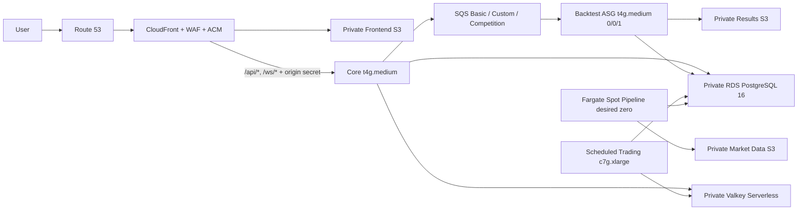

# Idea2Strategy Development AWS 아키텍처

상태: **배포 전 확정 설계**. 실제 AWS 구축 완료를 뜻하지 않는다. 실행 입력과
차단 조건은 [deploy-readiness-runbook.md](deploy-readiness-runbook.md), 구현은
`infra/terraform/environments/development`가 기준이다. 제품 의미·서비스 의무는
각각 `specs/**`, `contracts/**`가 우선한다.

## 확정 배치

| 경계 | 실행 단위 | 동작 방식 |
|---|---|---|
| Edge | Route 53, ACM, CloudFront, WAF, private Frontend S3 | Apex HTTPS, S3 OAC, `/api/*`와 `/ws/*`만 Core로 전달 |
| Core `t4g.medium` | `backend-api`, `backend-worker`, 조회용 `backtest-api` | 상시 실행 |
| Core 수동 profile | `backend-batch`, read-only `admin-mcp` | SSM 승인 작업 때만 실행 |
| Backtest `t4g.medium` ASG | `backtest-worker` | min/desired/max `0/0/1`, Basic/Custom/Competition 동시성 `2/1/1` |
| Trading `c7g.xlarge` | `market-gateway`, `trading-worker` | 미국 시장 시간 예약 실행, 종료 전 drain |
| Pipeline | ARM64 Fargate Spot `pipeline-worker` | desired zero, 이벤트/운영 작업 때만 실행 |
| Data | PostgreSQL 16, Valkey Serverless, S3 | RDS·Valkey는 private, S3는 public access 차단 |
| Durable work | SQS Standard + lane별 DLQ | Backtest 3개 lane, at-least-once와 애플리케이션 멱등성 |

## 네트워크와 보안

- NAT Gateway와 ALB는 사용하지 않는다. 공개 IPv4 비용을 감수하는 ARM64 EC2가
  직접 outbound하고, Core inbound 443은 AWS 관리 CloudFront origin-facing
  prefix list로 제한한다.
- CloudFront는 Core에 별도 검증 헤더를 추가한다. Core reverse proxy는 이 값이
  없거나 다르면 거절한다. 값은 Terraform state와 전용 Secrets Manager secret의
  민감정보다.
- S3 기본 behavior에만 SPA rewrite 함수를 연결한다. API의 403/404/5xx를
  `index.html`의 200 응답으로 바꾸지 않는다.
- RDS와 Valkey에는 public endpoint가 없다. Security Group은 필요한 runtime
  Security Group에서 오는 PostgreSQL/TLS 연결만 허용한다.
- SSH, key pair, bastion을 사용하지 않는다. 운영 접속과 수동 profile 실행은
  Systems Manager로 수행한다.
- EC2는 IMDSv2, 암호화된 root volume, rootless application container, read-only
  filesystem/capability drop/resource limit을 적용한다.
- CI는 GitHub OIDC의 `environment: development` subject만 신뢰한다. 장기 AWS
  access key를 GitHub에 저장하지 않는다.

## 데이터와 비밀정보 경계

- Flyway만 DDL을 수행한다. Backend가 조립한 중앙 bundle과 Trading의 pinned
  test baseline은 동일 digest를 가진다.
- runtime은 RDS master secret을 읽지 않는다. `backend`, `batch`, `backtest`,
  `trading`, `pipeline` LOGIN은 정확히 하나의 NOLOGIN 그룹 역할만 상속한다.
- Alpaca key/secret은 서로 분리된 Secrets Manager secret을 참조한다. 값은
  Terraform 변수, GitHub 로그, plan 텍스트, 명령 인자에 넣지 않는다.
- Backtest/Trading 정책 입력은 S3 version ID와 SHA-256을 동시에 고정하고
  시작 전에 검증한다.
- PostgreSQL은 상태와 manifest를, S3는 immutable 대용량 객체를 소유한다.
  Valkey는 재구축 가능한 stream/cache이며 공식 원장이 아니다.

## Backtest 포화와 축소

한 호스트 안에서 Basic 2개, Custom 1개, Competition 1개까지만 동시에
실행한다. 초과 요청은 각 SQS lane에 남고 다른 lane의 자리를 빌리지 않는다.
ASG 최대값 1은 처리량보다 비용 상한을 우선한 결정이다.

자동 scale-down은 현재 비활성이다. canonical DBML에 claim token, DB-time lease,
heartbeat, reclaim lineage와 cancellation 경계가 반영되고 race test가 통과하기
전에는 SQS approximate metric만으로 인스턴스를 종료할 수 없다. 그 전에는
queue/in-flight/DB claim을 확인한 운영자만 desired zero로 되돌린다.

## 장애와 복구 기준

- Development는 RDS Single-AZ와 단일 Core/Trading host를 사용하므로 무중단
  서비스를 보장하지 않는다. 복구 목표는 자동 재시작과 검증된 재배포다.
- Full 단계는 RDS PITR 7일 이상, deletion protection, S3 versioning, CloudWatch
  log/metric/alarm을 강제한다.
- Trading 시작은 durable reconciliation과 입력 materialization 검증 후에만
  열리고, 종료는 intake close → drain → checkpoint 순서다.
- Frontend는 `dns_foundation` 단계에 만든 private/versioned bucket의
  `/_releases/<root-sha-run-attempt>/`에 새 빌드를 한 번만 올린다. 저장된 full
  plan이 CloudFront S3 origin path를 그 불변 prefix로 전환하므로 mutable root
  복사와 invalidation이 없다. 롤백도 검증된 이전 release ID를 지정한 새 saved
  plan을 검토·적용한다.
- Terraform은 저장된 plan 파일만 apply하며 plan SHA-256과 S3 VersionId를
  Development 환경 승인 사이에서 검증한다. destroy/replace가 있으면 별도
  승인 없이 진행하지 않는다.

## 비용 경계

서울 리전의 현재 추정치는 월 **USD 141–181**, 보통 사용량 **USD 150–165**다.
월 예산은 USD 180, 경보는 80%/100%, USD 200은 운영 재검토 경계다. 변동폭은
Trading 실행일/시간, Valkey 사용량, CloudFront·S3 전송량, 로그 보존량,
Fargate Spot 실행량에서 발생한다. NAT Gateway, ALB, 상시 Backtest/Pipeline을
제외한 이유도 이 비용 경계를 지키기 위해서다.

## 배포 전 남은 외부 단계

코드가 준비되어도 다음은 AWS 변경이므로 별도 최종 plan·비용 승인 후에만 한다.

1. 기존 bootstrap state를 복구하고 isolated artifact/OIDC state plan을 검토한다.
2. GitHub `development` Environment에 승인자와 비밀이 아닌 AWS/TF 변수를 등록한다.
3. 다섯 runtime LOGIN과 Secrets Manager 값을 private-path one-shot 절차로 만든다.
4. 이미지 digest, frontend release, 정책 S3 version/checksum을 넣어 destroy 0의
   saved full plan을 만든다.
5. plan/비용/IAM/public path 검토 후 정확한 파일을 apply한다.
6. Gabia DNS 레코드를 모두 복제·검증한 뒤 nameserver를 Route 53으로 위임한다.
7. HTTPS, UI/API, RDS, Valkey, queue, service-to-service, health, logs, rollback을
   실제 환경에서 검증한다.

과거 ALB·3대 상시 EC2·Compute 공유 배치 문서는 역사적 검토 자료다. 현재 구현과
충돌하면 이 문서, deploy-readiness runbook, Terraform 순서로 확인하고 역사적
ADR을 현재 실행 지침으로 사용하지 않는다.
