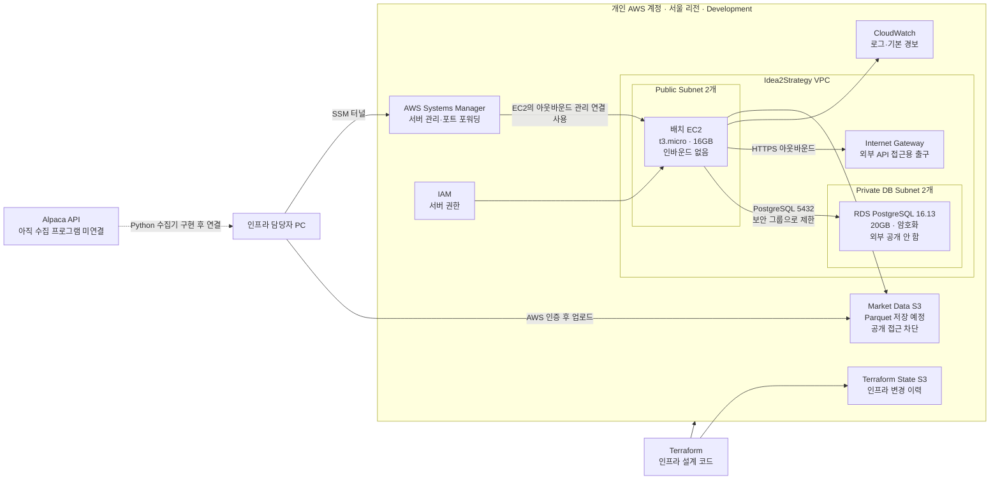
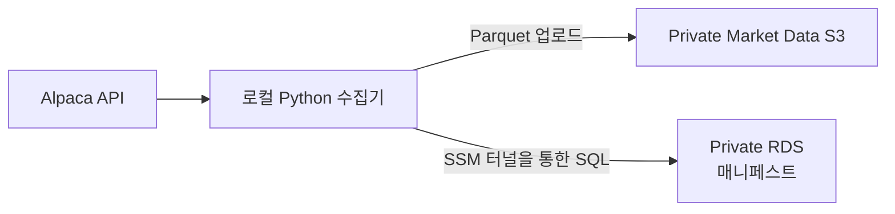
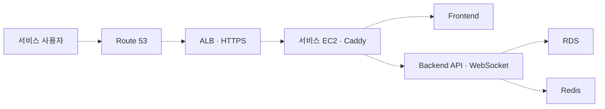
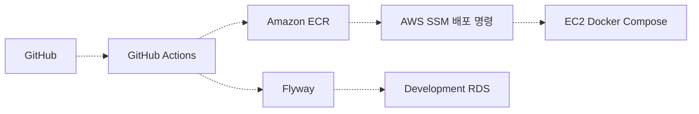

# Idea2Strategy AWS 인프라 이해 가이드

> 최신 목표 배치는 [백엔드·AWS 아키텍처 기준](backend-and-aws-architecture.md)의 Core·Trading·Compute EC2 세 대 구조다. 이 문서의 현재 AWS Bootstrap 설명은 유효하지만, 2 EC2·ALB·로컬 Redis를 전제로 한 향후 구조 설명은 결정 이력이며 최신 목표로 사용하지 않는다.

상태: **현재 AWS 구축 상태를 설명하는 팀 공유 문서**
기준일: **2026-07-30**
대상: AWS와 인프라 경험이 많지 않은 팀원

## 1. 이 문서의 목적

이 문서는 다음 세 가지를 구분해서 설명한다.

1. 지금 AWS에 실제로 만들어져 있는 것은 무엇인가?
2. 설계에는 포함되어 있지만 아직 만들어지지 않은 것은 무엇인가?
3. 이 구조를 어떤 관점으로 이해하고 팀원에게 설명하면 되는가?

가장 중요한 원칙은 **“AWS 리소스가 만들어졌다”와 “서비스가 완성됐다”를 같은 의미로 사용하지 않는 것**이다.

현재는 사용자가 접속하는 웹 서비스를 구축한 상태가 아니다. **과거 시장 데이터를 안전하게 적재하기 위한 최소 기반인 `Market Data Bootstrap` 단계만 구축한 상태**다.

---

## 2. 30초 요약

현재 Idea2Strategy AWS에는 다음 기반이 준비되어 있다.

- 외부와 격리된 Idea2Strategy 전용 네트워크인 VPC
- 과거 데이터 작업과 RDS 접속 경유지로 사용할 배치 EC2 한 대
- 서비스의 공식 상태와 데이터 매니페스트를 저장할 Private RDS PostgreSQL
- 대용량 시장 데이터 Parquet 파일을 저장할 Private S3
- SSH 포트를 열지 않고 서버를 관리하기 위한 AWS Systems Manager
- 서버와 저장소에 필요한 최소 권한을 부여하는 IAM
- 기본 로그와 CPU·상태 이상을 확인하기 위한 CloudWatch
- 위 리소스를 다시 만들 수 있도록 관리하는 Terraform과 별도 Terraform State S3

하지만 다음은 아직 없다.

- 사용자 웹 서비스
- Frontend와 Spring 애플리케이션
- ALB, Route 53, ACM을 이용한 `ideatostrategy.com` 접속 경로
- 데이터베이스 업무 테이블과 Flyway Migration
- 실제 과거 시장 데이터
- 과거 데이터 수집 Python 프로그램
- 실시간 SIP 수집기와 Redis
- CI/CD와 ECR
- Production 환경

즉, 현재 상태는 **“창고와 장부 보관실, 작업자용 출입 통로는 만들었지만 상품과 업무 프로그램은 아직 넣지 않은 상태”**라고 이해하면 된다.

---

## 3. 구축 상태를 읽는 기준

인프라 상태는 다음 네 단계로 나누어 읽어야 한다.

| 구분 | 의미 | 현재 예시 |
|---|---|---|
| 실제 구축 | AWS에 리소스가 존재하고 검증까지 완료됨 | VPC, 배치 EC2, RDS, Market Data S3 |
| 코드만 준비 | Terraform 코드에는 있지만 현재 단계에서 생성을 끔 | 서비스 EC2, ALB, Route 53, ACM, ECR |
| 방향만 확정 | 아키텍처 결정은 했지만 구현물이 아직 없음 | Spring 3개 실행 모듈, CQRS-lite, Flyway 운영 흐름 |
| 향후 검토 | 실제 필요와 부하가 확인되면 결정 | EC2 추가 확장, 메시지 큐, 별도 Grafana |

이 구분을 사용하면 “설계도에 있으니 이미 운영 중이다”라는 오해를 막을 수 있다.

---

## 4. 현재 실제로 구축된 AWS 아키텍처

### 4.1 전체 구조



점선은 아직 구현되지 않은 흐름이다.

### 4.2 실제 구축 요소

| 구성 요소 | 현재 상태 | 담당 역할 | 쉬운 비유 |
|---|---|---|---|
| 개인 AWS 계정 | 구축 | Development 리소스의 소유 경계 | 회사 건물 전체 |
| 서울 리전 | 구축 | 한국과 가까운 AWS 물리 지역 사용 | 건물이 위치한 도시 |
| VPC | 구축 | Idea2Strategy 전용 네트워크 경계 | 건물 주변의 담장 |
| Public Subnet 2개 | 구축 | 인터넷으로 나갈 수 있는 서버 배치 공간 | 외부 도로와 연결된 작업 구역 |
| Private DB Subnet 2개 | 구축 | 외부 경로가 없는 RDS 전용 공간 | 외부 문이 없는 문서 보관실 |
| Internet Gateway | 구축 | EC2가 Alpaca·AWS API 등에 요청을 보낼 수 있는 경로 | 건물에서 외부로 나가는 도로 |
| 배치 EC2 | 구축 | SSM 접속 경유지, 향후 과거 데이터·백테스트·배치 실행 | 작업용 컴퓨터 |
| RDS PostgreSQL | 구축 | 공식 상태, 데이터 관계, 매니페스트 저장 예정 | 공식 장부 보관실 |
| Market Data S3 | 구축 | 대용량 Parquet 파일 저장 예정 | 대형 파일 창고 |
| IAM Role | 구축 | EC2가 S3·SSM·CloudWatch·RDS 비밀에 접근할 권한 | 직원 출입증 |
| Systems Manager | 구축 | SSH 없이 서버 관리, Private RDS 터널 제공 | 보안 원격 관리 통로 |
| SSM Parameter Store | 구축 | RDS 주소·포트·DB 이름·S3 버킷 이름 보관 | 사내 주소록 |
| Secrets Manager | 구축 | RDS 마스터 비밀번호를 AWS가 생성·관리 | 비밀번호 금고 |
| CloudWatch | 구축 | EC2 로그와 EC2·RDS의 기본 상태 경보 | 기본 계기판과 경보기 |
| Terraform State S3 | 구축 | Terraform이 관리하는 실제 리소스 이력 보관 | 최신 시공 내역서 |

### 4.3 현재 보안 상태

- RDS는 `Publicly Accessible=false`다.
- RDS는 Private DB Subnet에만 배치되어 있다.
- RDS 5432 포트는 배치 EC2의 Security Group에서 오는 연결만 허용한다.
- 배치 EC2에는 인터넷 인바운드 규칙이 하나도 없다.
- 배치 EC2에는 SSH Key Pair가 없으며 22번 포트를 열지 않는다.
- 배치 EC2는 IMDSv2 사용을 강제한다.
- Market Data S3는 모든 Public Access를 차단한다.
- S3 Versioning, 서버 측 암호화와 TLS 연결 강제가 적용되어 있다.
- RDS 디스크도 암호화되어 있다.
- RDS 비밀번호는 Git이나 Terraform 변수에 직접 저장하지 않는다.

### 4.4 검증이 완료된 내용

- Terraform 구성 문법 검증 성공
- 실제 AWS 상태와 Terraform의 차이 없음: `No changes`
- RDS PostgreSQL 16.13 실행 상태 확인
- RDS 외부 공개 차단 확인
- S3 Public Access Block 확인
- S3 Versioning과 암호화 확인
- EC2 인바운드 규칙 0개 확인
- EC2 SSM 상태 `Online` 확인
- 로컬 PC에서 SSM 터널을 거쳐 Private RDS 5432까지 연결 확인

---

## 5. 현재 인프라에서 할 수 있는 일

현재 기반만으로 가능한 일은 다음과 같다.

1. 로컬 Python 프로그램이 Alpaca API에서 과거 데이터를 가져온다.
2. Python 프로그램이 데이터를 검증하고 Parquet 파일로 만든다.
3. AWS 인증을 사용해 Private Market Data S3에 Parquet 파일을 업로드한다.
4. 로컬 PC에서 SSM 터널을 열어 Private RDS에 접속한다.
5. RDS에 데이터셋·파일·해시·기간·행 수 등의 매니페스트를 등록한다.

다만 3~5번을 실제로 수행하기 전에 다음 구현이 필요하다.

- 확정된 S3 Prefix 규칙
- Parquet 파일 스키마와 파티션 기준
- RDS 매니페스트 테이블
- Flyway Migration
- 로컬 적재 작업용 최소 권한 IAM
- 재실행·중복 방지·검증 로직이 포함된 Python 수집 프로그램

따라서 현재는 **데이터를 받을 그릇과 안전한 접속 경로가 준비된 상태**다.

---

## 6. 현재 저장소별 데이터 역할

### 6.1 S3: 대용량 파일 창고

S3에는 다음과 같은 크고 변경하지 않는 데이터를 저장한다.

- 과거 OHLCV Parquet
- 향후 실시간 틱·호가 원본 Parquet
- 백테스트 거래·포지션 상세 결과
- 계산 재현용 시계열

시장 데이터 본문을 RDS에 전부 넣지 않는 이유는 다음과 같다.

- 10년치 시장 데이터는 행 수가 매우 많다.
- Parquet는 대량 분석과 압축에 적합하다.
- 파일 단위로 재처리하거나 버전을 나누기 쉽다.
- RDS의 용량과 조회 부하를 불필요하게 키우지 않는다.

### 6.2 RDS: 공식 장부와 파일 목록

RDS에는 다음과 같은 관계와 상태를 저장한다.

- 어떤 데이터셋이 존재하는지
- S3의 어느 객체가 그 데이터셋에 속하는지
- 심볼, 주기, 데이터 기간, 행 수
- 파일 해시와 스키마 버전
- 검증 성공·실패 상태
- 수집 실행 이력과 오류
- 향후 사용자·전략·봇·주문·체결·원장·백테스트 요약

RDS에는 대량 시장 데이터 본문 대신 **“S3에 무엇이 있고 그것을 신뢰할 수 있는가”를 설명하는 장부**를 저장한다.

### 6.3 Redis: 현재는 없음

Redis는 향후 서비스 EC2 안의 Docker 컨테이너로 둘 예정이다.

- 실시간 가격
- 사용자가 보고 있는 차트
- 재구축 가능한 조회 캐시

Redis 데이터는 공식 원장이 아니다. 장애로 없어지더라도 SIP나 RDS·S3를 이용해 다시 만들 수 있어야 한다.

### 6.4 세 저장소를 한 문장으로 설명

> RDS는 공식 상태와 데이터 관계를 보관하고, S3는 대용량 원본·상세 데이터를 보관하며, Redis는 언제든 다시 만들 수 있는 빠른 조회 데이터를 보관한다.

---

## 7. 아직 구축되지 않은 아키텍처

### 7.1 데이터 적재 단계에서 아직 필요한 것

| 항목 | 현재 상태 | 필요한 결과 |
|---|---|---|
| S3 Prefix 상세 규칙 | 설계 필요 | 환경·공급자·데이터 종류·주기·심볼·날짜·버전을 표현 |
| Parquet 스키마 | 설계 초안 존재 | 컬럼 타입, 시간대, 정규장 필터, 중복 기준 확정 |
| RDS 매니페스트 스키마 | 미구축 | Flyway Migration과 테이블 생성 |
| Python 수집기 | 미구축 | Alpaca 조회, 검증, Parquet 생성, S3·RDS 반영 |
| 적재 전용 IAM | 미구축 | 관리자 권한 대신 작업 범위만 허용 |
| 실제 10년 데이터 | 미적재 | S3 객체와 RDS 매니페스트가 일치 |
| 데이터 품질 검증 | 미구축 | 누락·중복·해시·행 수·기간 검증 |

현재 RDS 인스턴스와 기본 데이터베이스는 존재하지만 **서비스 테이블과 데이터 매니페스트 테이블은 아직 생성하지 않았다.**

### 7.2 사용자 서비스 단계

다음 구성은 Terraform의 `full` 단계 또는 향후 구현 대상으로 남아 있다.

| 구성 요소 | 역할 | 아직 만들지 않은 이유 |
|---|---|---|
| 서비스 EC2 | 웹·API·WebSocket·실시간 모의투자 실행 | Spring과 Frontend 배포물이 아직 없음 |
| Application Load Balancer | 사용자 요청을 서비스 EC2로 전달 | 공개할 서비스가 아직 없음 |
| Route 53 | `ideatostrategy.com` DNS 연결 | ALB 공개 시점에 필요 |
| ACM | HTTPS 인증서 발급 | 도메인 연결과 함께 적용 |
| Caddy | Frontend·API·WebSocket 경로 분기 | 서비스 EC2 Docker Compose에서 실행 예정 |
| Frontend | 사용자 웹 UI | Frontend 저장소·애플리케이션 구현 전 |
| Backend Spring | 일반 API·전략·봇·모의투자 처리 | 코드 멀티 모듈 구현 전 |
| Batch Spring | 주기 배치·리더보드 처리 | 코드 멀티 모듈 구현 전 |
| Backtest Spring | 백테스트 실행 | 코드 멀티 모듈 구현 전 |
| Redis | 실시간 가격·차트·캐시 | 실시간 서비스 EC2 구축 시 추가 |
| Market Data Worker | 과거·실시간 시장 데이터 수집 | Python 초기 적재기와 Spring 역할 경계 확정 필요 |
| Backtest Worker | 백테스트 계산 | 백테스트 애플리케이션 구현 전 |
| Results S3 | 백테스트 상세 결과 보관 | 아직 결과를 생성하지 않음 |
| ECR | Docker 이미지 저장 | CI/CD와 애플리케이션 이미지가 아직 없음 |
| GitHub Actions 배포 | 테스트·빌드·배포 자동화 | 실행 애플리케이션이 아직 없음 |
| Flyway 배포 작업 | DB 스키마 검증·적용 | 첫 Migration 작성 전 |

### 7.3 실시간 시장 데이터 단계

- SIP 실시간 연결
- 지원 종목 전체 구독
- 틱·호가 수집
- Redis Hot Projection 갱신
- 실시간 원본의 S3 저장
- WebSocket 가격·차트 전송
- 실시간 Worker 장애 복구

지원 범위와 전체 종목 구독 방향은 정했지만 실제 공급 계약, 연결 코드와 처리 용량은 아직 구현하지 않았다.

### 7.4 Production 환경

Production은 현재 전혀 생성하지 않았다.

향후 Production을 추가할 때는 Development와 다음을 공유하지 않는다.

- VPC
- EC2
- RDS
- S3
- IAM Role
- 비밀
- Terraform State

Production RDS는 Development RDS를 그대로 운영으로 바꾸지 않는다. 검토된 `B` Baseline Migration으로 새로 생성하고, 이후 검증된 `V` Migration을 순서대로 적용한다.

---

## 8. 의도적으로 넣지 않은 구성

현재 규모에서 다음 기술은 필요성이 확인되지 않았기 때문에 넣지 않았다.

- Kubernetes
- ECS
- 여러 대의 서비스 EC2
- NAT Gateway
- Bastion Host
- Jenkins
- Ansible
- Helm
- 별도 ElastiCache
- 확정되지 않은 메시지 큐
- 별도 Grafana 서버

이것은 확장할 수 없다는 뜻이 아니다. **먼저 단순한 구조로 운영하고 실제 병목이 측정되면 해당 부분을 분리한다는 뜻**이다.

예를 들어 배치 EC2의 처리 시간이 너무 길어지면 다음 순서로 확장할 수 있다.

1. EC2 사양을 높인다.
2. 작업 동시성이나 실행 시간을 조정한다.
3. 작업 실행기를 추가한다.
4. 필요하면 메시지 큐와 여러 Worker를 도입한다.

RDS와 S3에 공식 상태가 남기 때문에 EC2는 교체하거나 추가하기 쉽다.

---

## 9. 네트워크 구조를 이해하는 방법

### 9.1 Public Subnet은 “모두에게 공개”라는 뜻이 아니다

Public Subnet은 Internet Gateway로 나갈 수 있는 경로가 있다는 뜻이다.

배치 EC2는 Public Subnet에 있지만 Security Group의 인바운드 규칙이 0개이므로 인터넷 사용자가 EC2 포트로 들어올 수 없다. EC2의 인터넷 경로는 주로 다음 아웃바운드 요청에 사용한다.

- AWS Systems Manager
- AWS API
- 패키지 저장소
- 향후 Alpaca API

### 9.2 Security Group은 문 앞의 출입 명단이다

- 배치 EC2 문: 외부에서 들어오는 사람을 받지 않음
- RDS 문: 배치 EC2 출입증을 가진 연결의 5432 포트만 허용
- 향후 서비스 EC2 문: ALB 출입증을 가진 요청만 허용

IP 주소 전체를 허용하는 것보다 Security Group끼리 신뢰 관계를 연결하는 편이 역할을 이해하기 쉽고 안전하다.

### 9.3 SSM 터널은 임시 보안 통로다

로컬 PC가 RDS에 접속할 때 RDS를 인터넷에 공개하지 않는다.

```text
로컬 DB 도구 또는 Python
        ↓ 127.0.0.1:15432
SSM Remote Host Port Forwarding
        ↓
배치 EC2
        ↓ Private 네트워크 5432
RDS PostgreSQL
```

터널을 실행한 동안만 로컬 `127.0.0.1:15432`가 RDS로 연결된다. 터널 프로세스를 종료하면 경로도 닫힌다.

---

## 10. 요청 흐름과 데이터 흐름을 분리해서 이해하기

아키텍처를 볼 때 모든 화살표를 한 번에 이해하려고 하면 복잡해진다. 다음 세 흐름으로 나누어 본다.

### 10.1 현재 과거 데이터 흐름



이 흐름은 인프라만 준비됐으며 Python 수집기와 DB 스키마는 아직 구현 전이다.

### 10.2 향후 사용자 요청 흐름



모든 연결이 점선인 이유는 아직 구축되지 않았기 때문이다.

### 10.3 향후 배포 흐름



현재는 Terraform으로 AWS 기반만 만들었으며 애플리케이션 CI/CD는 아직 없다.

---

## 11. Terraform을 이해하는 방법

Terraform은 AWS 리소스를 만드는 자동화 스크립트라기보다 **인프라의 설계도와 현재 관리 목록**이다.

- `.tf` 파일: 어떤 리소스가 어떤 설정으로 있어야 하는지 선언
- Terraform State: Terraform이 실제로 만든 AWS 리소스의 대응 관계
- `terraform plan`: 설계도와 실제 AWS의 차이 확인
- `terraform apply`: 검토된 차이를 AWS에 반영

현재 `deployment_phase`는 다음처럼 사용한다.

| 값 | 의미 |
|---|---|
| `market_data_bootstrap` | 현재 적용값. 과거 데이터 준비에 필요한 최소 구성만 생성 |
| `full` | 향후 서비스 EC2, ALB, 도메인, ECR 등을 추가하는 단계 |

AWS 콘솔에서 리소스를 직접 수정하면 Terraform이 알고 있는 상태와 달라질 수 있다. 따라서 일반적인 변경 순서는 다음과 같아야 한다.

1. Terraform 코드를 수정한다.
2. `terraform fmt`와 `terraform validate`를 실행한다.
3. `terraform plan`으로 생성·변경·삭제 대상을 확인한다.
4. 비용과 보안 영향을 검토한다.
5. 검토된 plan만 `terraform apply`한다.
6. 실제 AWS 상태를 다시 검증한다.

---

## 12. 현재 구조의 비용과 제약

현재 고정 사용량 기준 예상 비용은 S3 데이터 사용량과 세금, AWS 크레딧 적용 전 약 **월 USD 36.17**이다.

주요 비용 발생 요소는 다음과 같다.

- 배치 EC2 `t3.micro`
- EC2 Public IPv4
- EC2 16GB `gp3`
- RDS `db.t4g.micro`
- RDS 20GB `gp3`
- RDS 관리형 비밀
- CloudWatch Alarm
- 실제 S3 저장량과 요청 수

현재 AWS Free Plan 제한 때문에 RDS는 다음과 같이 설정했다.

- 자동 백업 보존: 1일
- 저장 용량: 20GB
- 스토리지 자동 확장: 비활성화

Paid Plan으로 전환하면 우선 백업 보존 기간을 7일로 올리고, 데이터 증가량을 확인한 뒤 RDS 자동 확장 상한을 설정해야 한다.

RDS 20GB에는 10년치 시장 데이터 본문을 넣지 않는다. 시장 데이터 본문은 S3에 저장하고 RDS에는 비교적 작은 매니페스트와 업무 상태만 저장하므로 역할상 문제가 없다.

---

## 13. 팀원에게 설명하는 방법

### 13.1 설명 순서

서비스 이름을 나열하기보다 다음 순서로 설명한다.

1. **현재 목표**: 사용자 서비스가 아니라 과거 데이터 적재 기반을 먼저 만들었다.
2. **실행 장소**: 배치 EC2가 작업을 실행하거나 Private RDS 접속을 중계한다.
3. **데이터 저장**: 큰 파일은 S3, 공식 관계와 상태는 RDS다.
4. **보안**: RDS와 S3를 공개하지 않고 IAM과 SSM을 사용한다.
5. **재현 방법**: 모든 AWS 리소스는 Terraform으로 관리한다.
6. **향후 확장**: 서비스 코드가 준비되면 서비스 EC2, ALB, 도메인과 CI/CD를 추가한다.

### 13.2 1분 설명 예시

> 현재 AWS에는 완성된 웹 서비스가 아니라 과거 시장 데이터를 적재하기 위한 최소 개발 기반만 있습니다. 대용량 Parquet 파일은 Private S3에 저장하고, 그 파일의 위치·기간·해시와 서비스의 공식 상태는 Private PostgreSQL RDS에 저장합니다. RDS는 인터넷에 공개하지 않았고, 로컬에서 필요할 때만 SSM을 통해 배치 EC2를 경유해 접속합니다. 배치 EC2도 SSH나 외부 인바운드 포트가 없습니다. 이 전체 구성은 Terraform으로 다시 만들 수 있습니다. Frontend, Spring, ALB, 도메인, Redis, ECR과 Production은 애플리케이션 준비가 끝난 뒤 단계적으로 추가할 예정입니다.

### 13.3 더 쉬운 비유

> AWS 계정은 회사 부지, VPC는 담장, Subnet은 구역, Security Group은 출입 명단입니다. EC2는 작업용 컴퓨터이고, RDS는 공식 장부 보관실, S3는 대형 파일 창고입니다. SSM은 외부 문을 상시 열어두지 않고 필요할 때만 사용하는 원격 관리 통로입니다. Terraform은 이 시설을 동일하게 다시 만들 수 있는 설계도와 시공 기록입니다.

---

## 14. 자주 생기는 오해

### “EC2가 Public Subnet에 있으니 인터넷에서 접속 가능한 것 아닌가?”

아니다. 인터넷 경로와 Public IPv4가 있어도 Security Group 인바운드가 없으면 외부에서 서비스 포트로 들어올 수 없다.

### “RDS가 만들어졌으니 DB 개발이 끝난 것 아닌가?”

아니다. PostgreSQL 서버만 만들어졌다. 업무 테이블, 매니페스트 테이블, 역할별 계정과 Flyway Migration은 아직 필요하다.

### “S3가 만들어졌으니 바로 아무 파일이나 넣어도 되는가?”

권장하지 않는다. Prefix, Parquet 스키마, 객체 메타데이터, 해시와 RDS 매니페스트 규칙을 먼저 고정해야 나중에 데이터를 다시 옮기거나 전수 수정하는 일을 줄일 수 있다.

### “백테스트·배치 EC2가 있으니 백테스트가 실행되는가?”

아니다. 실행 서버만 있다. Batch Spring, Backtest Spring과 Docker Compose 배포가 아직 없다.

### “Terraform 코드에 ALB와 Route 53이 있으니 도메인 접속이 되는가?”

아니다. 해당 리소스는 `full` 단계에서만 생성된다. 현재 적용 단계에서는 비활성화되어 있다.

### “Development와 Production을 합친 것인가?”

아니다. 지금은 Development만 만들었고 Production은 만들지 않았다. 나중에 별도 리소스로 추가한다.

### “RDS와 S3가 Private이면 로컬 적재가 불가능한가?”

아니다. S3는 인증된 AWS API로 접근하고 RDS는 SSM 터널을 통해 접근한다. 공개 설정은 필요하지 않다.

---

## 15. 다음 구축 순서

### 단계 1: Market Data Bootstrap — 완료

- VPC와 Subnet
- 배치 EC2
- Private RDS PostgreSQL
- Private Market Data S3
- IAM·SSM·CloudWatch
- Terraform State
- SSM RDS 터널 검증

### 단계 2: 과거 데이터 적재 — 다음 작업

1. S3 Prefix와 Parquet 스키마 확정
2. RDS 매니페스트 스키마 확정
3. 첫 Flyway Migration 작성·적용
4. 로컬 적재 전용 최소 권한 IAM 구성
5. Python 수집기 구현
6. 소량 샘플 데이터 적재
7. S3 객체와 RDS 매니페스트 일치 검증
8. 10년치 전체 데이터 적재
9. 누락·중복·해시·기간 전수 검증

### 단계 3: Development 사용자 서비스

1. 서비스 EC2 생성
2. Frontend와 Spring 멀티 모듈 Docker 이미지 준비
3. Redis와 Caddy 구성
4. ALB·Route 53·ACM 구성
5. ECR·GitHub Actions·SSM 배포 구성
6. 실시간 SIP와 WebSocket 연결
7. 운영 지표와 비용 측정

### 단계 4: Production

1. 운영 기준 `B` Baseline Migration 확정
2. 별도 Production VPC·RDS·S3·IAM·State 생성
3. 검증된 불변 데이터 이관
4. 검증된 애플리케이션 이미지 Digest 배포
5. 백업 복원과 장애 대응 검증

---

## 16. 현재 상태 확인 체크리스트

팀원이 “지금 어디까지 됐나?”라고 물으면 다음 체크리스트로 답한다.

| 질문 | 현재 답 |
|---|---|
| AWS 계정과 리전이 정해졌는가? | 예, 개인 AWS 계정·서울 리전 |
| Development 네트워크가 있는가? | 예 |
| 과거 데이터를 저장할 S3가 있는가? | 예, 비공개 상태 |
| 공식 상태를 저장할 RDS가 있는가? | 예, PostgreSQL 16.13·비공개 상태 |
| 로컬에서 RDS에 안전하게 접속 가능한가? | 예, SSM 터널 검증 완료 |
| 실제 데이터가 적재됐는가? | 아니오 |
| DB 업무 스키마가 적용됐는가? | 아니오 |
| Python 수집기가 있는가? | 아니오 |
| 웹 서비스가 배포됐는가? | 아니오 |
| 도메인으로 접속 가능한가? | 아니오 |
| 실시간 SIP가 연결됐는가? | 아니오 |
| Production이 있는가? | 아니오 |

---

## 17. 관련 문서

- [전체 인프라 구조와 결정 기록](architecture.md)
- [과거 시장 데이터 로더 구현 명세](historical-market-data-loader-implementation-spec.md)
- [Terraform 실행 방법과 SSM 터널](../../infra/terraform/README.md)
- [Development 월비용 추정](../../infra/terraform/COST-ESTIMATE.md)
- [인프라 결정 기록](decisions/README.md)

이 문서는 실제 구축 상태가 바뀔 때 함께 갱신한다. 특히 `deployment_phase`를 `full`로 변경하거나, 과거 데이터 적재를 완료하거나, Production을 생성할 때 “실제 구축”과 “미구축” 표를 반드시 다시 확인한다.
