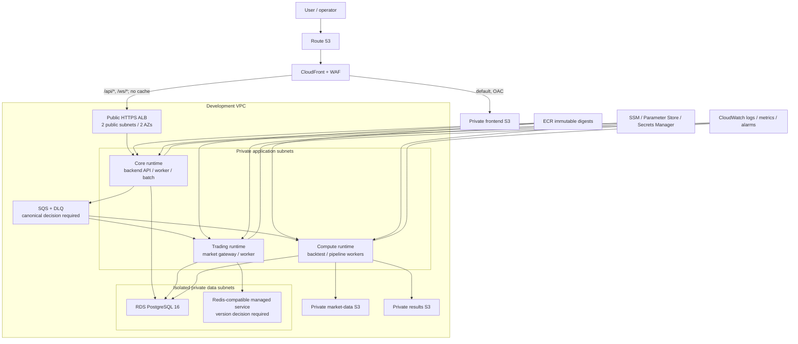

# AWS architecture review proposal — 2026-08-04

Status: **isolated proposal; not approved for canonical implementation or release**

The attached diagram (`C:\Users\SSAFY\Desktop\image.png`, SHA-256
`b0015948c48e9a0ad5dc1120989082dc5308fd5105c3c1b510a6a0783d1c0efb`) is a useful
logical responsibility map, but it is not a deployable physical architecture.
Fresh `stackcord governance check --json` returned `unknown`, so this document does
not change `specs/**`, `contracts/**`, or an approved architecture decision.

## Review result

The diagram must not be applied unchanged.

| Area | Finding | Required correction |
| --- | --- | --- |
| Network | VPC, Availability Zones, subnet tiers, route tables, IGW, NAT/egress and VPC endpoints are absent. | Show two public ALB subnets, private application subnets and isolated private data subnets across at least two AZs. Keep EC2 without public IP or SSH; use SSM and reviewed egress. |
| Ingress | CloudFront points to S3 and ALB without cache behaviours, origin restrictions or certificate regions. | Use one CloudFront distribution: default behaviour to a private frontend S3 origin through OAC; `/api/*` and `/ws/*` to an HTTPS ALB origin with caching disabled. Use an ACM certificate in `us-east-1` for CloudFront and a regional certificate for ALB. |
| Security | The operator appears to reach `admin-mcp` directly. IAM roles, WAF, secret boundaries and target SG references are not shown. | Never expose `admin-mcp` directly. Protect operator routes at ALB and backend according to the approved operator-trust contract; run bootstrap commands through SSM. Give each runtime a separate least-privilege instance/task role. Restrict targets to the ALB SG. |
| Compute | One Core, Trading and Compute EC2 instance each is a single point of failure and the drawing does not show image or lifecycle management. | Pin immutable ECR digests, deploy through SSM, and put each role behind a replaceable launch template/Auto Scaling boundary. Development may start at desired capacity one; production availability requires at least two Core targets across AZs and an approved Trading failover/deduplication design. |
| Database | PostgreSQL placement, encryption, backup, deletion protection, connection limits and failover are not shown. | Use encrypted, non-public RDS in isolated DB subnets, SG references from approved workloads only, managed credentials, deletion protection, automated backups/PITR and tested restore. Production requires Multi-AZ after an explicit cost/RTO decision. |
| Redis | `Redis 7.4 — deployment TBD` is not deployable. ElastiCache does not offer Redis OSS 7.4; its supported Redis OSS line ends at 7.1. | Product authority must choose a compatible managed Valkey/Redis version or accept the operational burden of self-managed Redis 7.4. Require TLS, authentication, private subnets and failover if a managed replication group is selected. Do not use Redis as the durable job queue. |
| Durable work | “Durable Work Queues” has no product, queue type, retry, DLQ or IAM boundary. | The implementation and tests currently exercise SQS, but the canonical infrastructure decision is still TBD. An approved decision must pin Standard/FIFO per route, visibility timeout, retention, DLQ/redrive, encryption, idempotency and producer/consumer IAM. |
| Storage | Frontend, market-data and results buckets have no public-access or lifecycle boundary. | Use separate private buckets with public access blocked, ownership enforced, versioning, encryption and TLS-only policies. Permit frontend reads only through CloudFront OAC. Add lifecycle/retention only after data-retention approval. |
| Observability | Logs are shown, but alarms, traces, audit and notifications are not connected. | Centralize application/host/ALB logs, define health/latency/5xx/queue-age/DLQ/RDS/Redis alarms and an owned notification destination. Enable CloudTrail/account guardrails outside the workload stack. |
| Resilience | No RTO/RPO, backup restore, AZ failure, queue poison-message or rollback flow is represented. | Define and test rollback, RDS restore, compute replacement, DLQ redrive, duplicate/out-of-order delivery and degraded Redis behaviour before calling the environment Deploy Ready. |
| Cost | Three always-on EC2 instances, ALB, NAT, RDS, Redis and public IPv4/traffic costs are not stated. | Produce a reviewed Terraform plan and current AWS Pricing Calculator estimate. Keep development desired capacities and log retention small; do not trade away private workload placement without explicitly accepting the risk. |

## Corrected target topology

## Release gates before an AWS apply

1. A fresh provider observation approves the protected architecture changes by one
   of the configured product authorities.
2. The Redis compatibility/operating-product decision and durable queue contract
   are approved; the exact Terraform implementation follows those decisions.
3. An authenticated short-lived AWS identity, exact account, `ap-northeast-2`
   region, remote-state backend and DNS zone are reviewed.
4. A saved Terraform plan has zero unexpected destroy/replace actions and a named
   owner approves its recurring cost.
5. Immutable images, runtime secrets, OIDC inputs and Flyway bundle are present.
6. Apply, DNS delegation, schema migration and application rollout use separate,
   reversible checkpoints with captured evidence.

Until all gates pass, the attached architecture and this correction are neither
approved nor Deploy Ready.

## Recommended Development decision for approval

The balanced Development choice is **three isolated runtime roles without
production-grade multi-AZ duplication**:

1. **Edge:** Route 53 -> CloudFront + a small WAF policy. The default behavior
   serves a private, versioned frontend S3 bucket through OAC. `/api/*` and
   `/ws/*` use a public ALB because the current application requires WebSocket
   compatibility. The ALB accepts only the AWS CloudFront origin-facing prefix
   list and forwards only when a distribution-specific secret header matches.
2. **Network:** two public ALB/NAT subnets, two private application subnets and
   two isolated database subnets across two AZs. Development uses one NAT
   Gateway plus the free S3 Gateway Endpoint. This deliberately accepts one
   egress-AZ dependency to avoid the cost of a second NAT Gateway; production
   must use one NAT per AZ.
3. **Compute:** Core, Trading and Compute remain separate because their latency,
   failure and resource profiles differ. Each starts as one private EC2 host,
   has no SSH/public IP, uses IMDSv2 and SSM, and is recovered in place by a
   CloudWatch EC2 recovery alarm. This is an accepted Development availability
   trade-off, not a production HA claim. Trading and Compute should be stopped
   outside their test/market windows after deployment validation.
4. **Data:** encrypted, non-public PostgreSQL 16 remains Single-AZ with deletion
   protection, forced TLS and at least seven days of PITR. Multi-AZ and RDS Proxy
   are intentionally deferred as excessive for Development.
5. **Cache:** managed Valkey 8.0, cluster mode disabled for compatibility, in
   private application subnets with TLS, at-rest encryption and an AUTH token in
   Secrets Manager. One node is the low-cost Development default; cache loss must
   fail closed and recover from authoritative data. Production requires an
   approved failover topology.
6. **Durable work:** separate SQS Standard queues and DLQs for official backtests
   and pipeline work, SSE, long polling, explicit visibility, redrive allow
   policy and least-privilege producer/consumer IAM. Consumers must heartbeat
   work longer than the visibility timeout and remain idempotent. No trading
   command FIFO queue is created until ordering semantics are approved.
7. **Delivery:** private ECR repositories exist for every deployable process and
   the full phase rejects mutable tags or missing image digests. Frontend builds
   use an immutable release ID. Terraform provisions infrastructure; reviewed CI
   publishes artifacts and SSM performs rollout/rollback.
8. **Operations:** CloudWatch logs and alarms, SNS ownership, queue/DLQ/cache
   alarms and a USD 300 Development budget are provisioned. Application, ALB,
   RDS, queue and cache verification remains a mandatory post-apply gate.

### Explicitly not selected

- ECS/EKS migration, two NAT Gateways, Multi-AZ RDS, RDS Proxy and three
  always-on duplicated runtime fleets are excessive for the current Development
  load.
- Public-IP application EC2, self-managed Redis 7.4, Redis as a durable queue,
  direct public admin MCP access, mutable image tags and shared static AWS access
  keys are not acceptable shortcuts.
- ElastiCache Serverless is cheaper at its storage floor and automatically
  Multi-AZ, but it is not selected until the current standalone Redis clients
  pass cluster-mode and TLS/AUTH compatibility tests.

### Cost envelope before an exact plan

At 730 hours/month in Seoul, the conservative always-on topology is expected to
be roughly **USD 240-270/month plus request, log and transfer variance**. The
largest inputs are Compute `m7i-flex.large` (~USD 86), Core/Trading EC2 (~USD
57 combined at the current sizes), one NAT Gateway and IPv4 (~USD 47 before
data), RDS (~USD 21 including storage), ALB (~USD 16 before LCU), node-based
Valkey (~USD 14), EBS (~USD 15), and WAF/CloudWatch/Secrets/S3/CloudFront usage.
Stopping Trading and Compute outside a roughly 220-hour monthly window is
expected to reduce the envelope to about **USD 165-190/month**. These are design
inputs, not the final estimate; the exact saved plan and current pricing are
reviewed only after approval.

### Approval requested

Approve this proposal only if all four choices are accepted together:

- three private singleton Development runtimes with EC2 auto-recovery;
- one NAT Gateway in Development and the documented single-AZ egress risk;
- node-based Valkey 8.0 single-node Development cache with TLS/AUTH;
- SQS Standard queues for backtest and pipeline work, with no unapproved trading
  FIFO semantics.

Fresh GitHub provider approval by a configured product authority is still
required before this proposal can change protected canonical architecture or be
used for an AWS apply.
