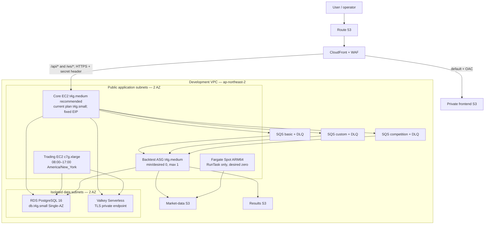

# AWS Development architecture review proposal — 2026-08-04

Status: **isolated proposal; implementation may be reviewed, but protected product meaning is not approved**

The supplied diagram is a useful logical responsibility map, but it is not safe
to deploy unchanged. It omits subnet and route boundaries, concrete queue
semantics, runtime lifecycle, origin authentication, recovery rules, and cost
controls. A fresh governance observation is still unavailable, so this proposal
does not edit `specs/**` or `contracts/**`.

## Selected low-cost Development topology

There is deliberately no NAT Gateway, ALB, bastion, SSH rule, always-on
backtest/pipeline host, or Development Multi-AZ database. Runtime instances use
ARM64 images, IMDSv2 with hop limit one, SSM, encrypted gp3, and no inbound rules
except Core TCP 443 from the AWS-managed CloudFront origin-facing prefix list.
CloudFront also sends a per-distribution secret header; Nginx retrieves the
secret at runtime and rejects requests without it. DNS-01 ACME provides the
trusted Core origin certificate without opening port 80 or exporting private
keys through Terraform.

## Why this differs from the earlier USD 240 design

The earlier estimate assumed three private always-on EC2 roles, a NAT Gateway,
an ALB, node-based Valkey, and a large always-on x86 Compute host. Those fixed
charges dominated the bill. This design removes roughly USD 43/month NAT,
USD 16/month ALB, and about USD 86/month always-on large Compute, then replaces
them with a scheduled Trading host, a 100-hour example Backtest worker, and
event-only Fargate Spot. The trade is explicit: Development has lower ingress
and egress infrastructure redundancy, and public-IP runtime subnets require very
strict security groups and host hardening.

## Runtime and recovery rules

- Core is the only 24-hour application host. The recommended continuous units
  are `backend-api`, the durable outbox `backend-worker`, and the result-reading
  `backtest-api`. `backend-batch` runs only for scheduled jobs and `admin-mcp`
  only during an authorized operator session. Pipeline, Trading, and the
  compute-heavy Backtest worker do not run on Core.
- Trading is On-Demand, never Spot. EventBridge Scheduler starts it at 08:00 and
  stops it at 17:00 in `America/New_York`. Startup and shutdown reconciliation
  must compare Alpaca orders/fills with PostgreSQL, preserve idempotency, and
  keep `extended_hours=false`.
- Backtest starts when any lane has visible work. The single `t4g.medium` worker
  target exposes four logical slots: Basic 2, Custom 1, and Competition 1; requests over
  a lane limit remain queued. The instance uses Standard CPU credits and raises
  CPU, credit-balance, memory, and queue-latency alarms so resizing is driven by
  evidence. Scale-down is worker-initiated only after all three queues have zero
  visible/in-flight messages, PostgreSQL has no valid RUNNING claim,
  result/checkpoint persistence is confirmed, and a 15-minute idle grace elapsed.
  SQS approximate metrics alone never stop it.
- Pipeline has no ECS service. A schedule/event invokes one ARM64 Fargate Spot
  task with a public IP for egress; checkpoints and content-addressed manifests
  remain in S3.
- Valkey contains only reconstructible session/cache/temporary-stream state.
  Orders, fills, ledgers, claims, and outbox records remain authoritative in
  PostgreSQL.

## Deployment-unit correction still requiring approval

The current Terraform plan is an infrastructure envelope, not a complete
application rollout. Its EC2 bootstrap does not start application containers,
and the diagram's process grouping cannot be copied onto the selected sizes
without correction:

- A `t4g.small` has 2 GiB memory. Running `backend-api`, `backend-worker`,
  `backend-batch`, and `admin-mcp` as four continuous JVMs on it is predictably
  memory-constrained before normal OS, Docker, Nginx, and CloudWatch Agent
  overhead. This is an under-provisioned deployment unit, not merely a future
  traffic-scaling concern.
- Recommended Core placement is `backend-api` plus the durable outbox relay
  `backend-worker` continuously, with explicit heap/container limits. Start
  `backend-batch` only for scheduled jobs and `admin-mcp` only for an authorized
  operator session. Use `t4g.medium` initially unless a representative
  container memory/GC test proves the two continuous processes and host agents
  stay within a safe `t4g.small` envelope.
- The Backtest worker remains the approved `t4g.medium` ASG `0/0/1` with Basic
  2, Custom 1, Competition 1, total 4. The recommended placement for the
  independently packaged `backtest-api` is Core, bound to an internal/loopback
  route, because its durable result-read endpoints must remain available while
  the worker ASG is zero. This recommendation increases the Core memory envelope
  and still requires the API's production collaborator factories and auth route
  to be implemented and verified; those are not invented by Terraform.
- A complete rollout therefore still needs reviewed systemd/container units,
  runtime secret and database/cache/queue wiring, health checks, graceful drain,
  frontend artifact publication/invalidation, and an explicit `backtest-api`
  placement decision. Terraform must not be applied as a service rollout before
  those units and tests exist.

Cost impact of the recommended Core `t4g.medium` starting point is about USD 15
per 730-hour month above the current `t4g.small` plan, before tax and transfer.
Keeping `t4g.small` is acceptable only as a measured optimization after the
real container bundle exists; it is not assumed safe for the original four-JVM
diagram.

## Approval and apply gates

1. Review the saved full Terraform plan and current cost report.
2. Obtain fresh protected-meaning approval through the configured GitHub review
   provider before integrating queue/recovery semantics into canonical sources.
3. Confirm the exact AWS account, hosted zone/delegation, artifact digests,
   frontend release ID, budget owner, and alert destination.
4. Apply foundation/ECR first, publish ARM64 immutable images, produce a second
   exact plan with real digests, and obtain confirmation for that candidate.
5. Apply infrastructure, validate DNS/ACM/ACME, migrate PostgreSQL, roll out Core,
   Trading, Backtest and Pipeline separately, and capture rollback evidence.

No AWS mutation, DNS delegation, image publication, service rollout, or release
is authorized by this proposal alone.
